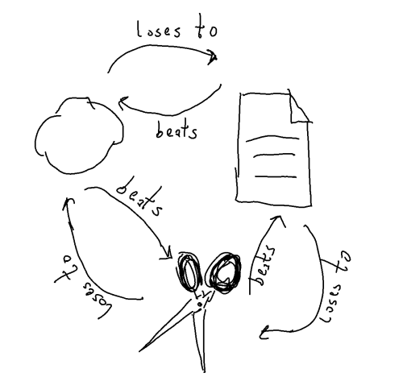

# Rock, Paper, Scissors

🪨 📰 ✂️

This is a C# simulation of the the famous Rock, Paper, Scissors game
analyzing the success of different strategies.

For details, have a look at [my blog post about it](https://wolfgang-ziegler.com/blog/rock-paper-scissors).